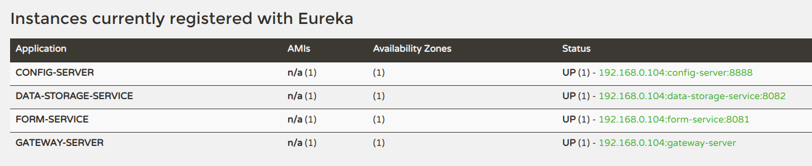

#  Anonymous Surveys

An application which allows users to conduct surveys anonymously.

This application has two actors
1. **Survey-Creator**: One who creates the _survey_.
1. **Survey-Respondent**: One who submits response of said _survey_.

The reason it is called _Anonymous_ is;
* _Survey-Creator_ does not know who are submitting the responses (unless respondent has implicitly provided).
* _Survey-Respondent_ does not who has created the survey. (unless creator has implicitly provided that)
## Features:
* _Survey-Creator_ first creates a survey.
* A survey consists of couple of questions
* Questions can be of the following types:
    * Text
    * Date
    * Time
    * Single Choice (Radio)
    * Multiple Choice (Checkbox)
* Questions can be marked as **compulsory**
* _Survey-Creator_ submits inorder to create the survey.
* After successfully creating a survey, the following are generated:
    * A unique survey-ID
    * An access key (to access responses)
    * Submission link to submit responses
* _Survey-Creator_ will share the submission link with the _Survey-Respondent(s)_.
* _Survey-Respondent(s)_ visits the submission link and submits their response.
* _Survey-Creator_ access with survey responses, with the survey-ID and access key generated after survey creation.
* Responses are displayed in the form of a table.
* _Survey-Creator_ can download the survey-responses in the form of **CSV**.

## Design

This whole system is split into different microservices.
* **Data Storage Service**: Responsible for storage and retrieval the created surveys and its submissions. (acts as the DAO layer)
* **Form Service**: Responsible for handling form-creation and submission of surveys.(acts as the service layer)
* **Gateway Server**: Responsible for routing requests from clients to the microservices.
* **Discovery Service**: Service Registry for microservice inter-communication.
* **Config Server**: Centralized Configuration Server to provide configurations to the microservices.
* **App-UI**: (Not a microservice) but acts as main front-end client app.

## To Start

1. Clone the project (including submodules)
1. Navigate to project <a href="./">root</a> directory
1. Specify MongoDB configuration in <a href="config-server/src/main/recources/data-storage-service-dev.yml">data-storage-service-dev.yml</a>
1. Specify Redis configuration in <a href="config-server/src/main/recources/form-service-dev.yml">form-service-dev.yml</a>
1. Start your MongoDB and Redis Server
1. Run the following commands to start spring-boot apps (**for first two commands; wait until it's fully up and running**):
    1. `./mvnw spring-boot:run -f discovery-server/pom.xml &`
    1. `./mvnw spring-boot:run -f config-server/pom.xml &`
    1. `./mvnw spring-boot:run -f gateway-server/pom.xml &`
    1. `./mvnw spring-boot:run -f data-storage-service/pom.xml &`
    1. `./mvnw spring-boot:run -f form-service/pom.xml &`
1. Open `http://localhost:8761` to see if these four instances are showing registered or not.
    
1. Navigate to <a href="app-ui/">app-ui</a> directory
1. Run the following commands to start react app:
    1. `npm run build`
    1. `npx serve -s build/ &`
1. Open `http://localhost:5000`

## To Stop
1. Open `http://localhost:8761`
1. Navigate to Instances currently registered with Eureka
    
1. Note down the ports of the services (Check the Status column and last 4 digits are the port number on which the services are listening to)
1. Run the following command for each terminal
    * `curl -X POST http://localhost:${PORT}/actuator/shutdown`
    * replace PORT with the actual port
1. Finally run `curl -X POST http://localhost:8761/actuator/shutdown` to terminate the Eureka server.
1. Run `kill $(lsof -t -i:5000)` to stop npm serve
1. Don't forget to stop your MongoDB and Redis servers.
## Screenshots
* Homepage:

* Create Survey:

* Widgets:

* Survey Creation Success:

* Submit Response:

* Date & Time Widgets:

* Submit Success:

* Access Response:

* Responses:

* Downloaded Responses CSV file:

